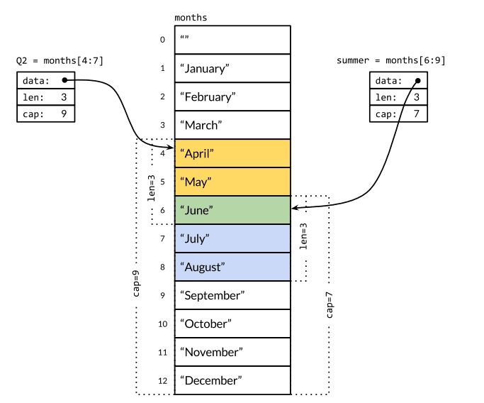

## 安装golang

```bash

installgo (){

brew install go
cat << EOF >>  ~/.zshrc    
export GOPATH=$HOME/go
EOF

echo $GOPATH
cd $GOPATH/src
mkdir -p golang.org/x/
cd golang.org/x/
git clone https://github.com/golang/tools.git
git clone https://github.com/golang/sys.git
git clone https://github.com/golang/net.git
git clone https://github.com/golang/time.git
git clone https://github.com/golang/lint.git

# https://github.com/Microsoft/vscode-go/wiki/Go-tools-that-the-Go-extension-depends-on
go get -u -v github.com/mdempsky/gocode
go get -u -v  github.com/ramya-rao-a/go-outline
go get -u -v  github.com/acroca/go-symbols
go get -u -v  github.com/stamblerre/gocode
go get -u -v  github.com/sqs/goreturns

}
```

## 数组切片



## 数据类型

```
uint8       the set of all unsigned  8-bit integers (0 to 255)
uint16      the set of all unsigned 16-bit integers (0 to 65535)
uint32      the set of all unsigned 32-bit integers (0 to 4294967295)
uint64      the set of all unsigned 64-bit integers (0 to 18446744073709551615)

int8        the set of all signed  8-bit integers (-128 to 127)
int16       the set of all signed 16-bit integers (-32768 to 32767)
int32       the set of all signed 32-bit integers (-2147483648 to 2147483647)
int64       the set of all signed 64-bit integers (-9223372036854775808 to 9223372036854775807)

float32     the set of all IEEE-754 32-bit floating-point numbers
float64     the set of all IEEE-754 64-bit floating-point numbers

complex64   the set of all complex numbers with float32 real and imaginary parts
complex128  the set of all complex numbers with float64 real and imaginary parts
byte        alias for uint8
rune        alias for int32
```

## 其他技巧

```go
import(
    "fmt"
    "os"
)

m := `hello
    world`

    
//Go里面有一个关键字iota，这个关键字用来声明enum的时候采用，它默认开始值是0，const中每增加一行加1：
    

a := [...]int{4, 5, 6}

if x := computedValue(); x > 10 {
    fmt.Println("x is greater than 10")
} else {
    fmt.Println("x is less than 10")
}


for _, v := range map{
    fmt.Println("map's val:", v)
}


type testInt func(int) bool // 声明了一个函数类型


cs := make(chan string)

//强制类型断言
v.(type) 

```

## 点操作

    我们有时候会看到如下的方式导入包
```go
import(
    . "fmt"
)
```
    这个点操作的含义就是这个包导入之后在你调用这个包的函数时，你可以省略前缀的包名，也就是前面你调用的fmt.Println("hello world")可以省略的写成Println("hello world")
## 别名操作
    别名操作顾名思义我们可以把包命名成另一个我们用起来容易记忆的名字
```go
import(
    f "fmt"
)
```
    别名操作的话调用包函数时前缀变成了我们的前缀，即f.Println("hello world")
## _操作

这个操作经常是让很多人费解的一个操作符，请看下面这个import
```go
import (
    "database/sql"
    _ "github.com/ziutek/mymysql/godrv"
)
```
_操作其实是引入该包，而不直接使用包里面的函数，而是调用了该包里面的init函数。

## Race Detector 竞态分析

go test -v -race

https://tonybai.com/2015/08/25/go-debugging-profiling-optimization/


## 开启逃逸分析

>  当一个变量(或对象)在子程序中被分配时，一个指向变量的指针可能逃逸到其它执行线程中，或者去调用子程序。如果使用尾递归优化（通常在函数编程语言中是需要的），对象也可能逃逸到被调用的子程序中。 如果一个子程序分配一个对象并返回一个该对象的指针，该对象可能在程序中的任何一个地方被访问到——这样指针就成功“逃逸”了。
> 
> 开启逃逸分析日志很简单，只要在编译的时候加上-gcflags '-m'，但是我们为了不让编译时自动内连函数，一般会加-l参数，最终为-gcflags '-m -l'


    go run -gcflags '-m -l' escape.go


参考链接:
1. [golang中sync.RWMutex和sync.Mutex区别](https://blog.csdn.net/chenbaoke/article/details/41957725)
1. [Golang逃逸分析](https://gocn.vip/article/355)


