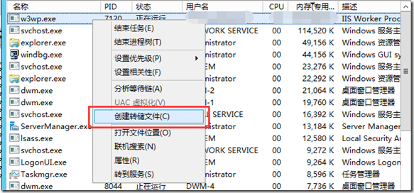
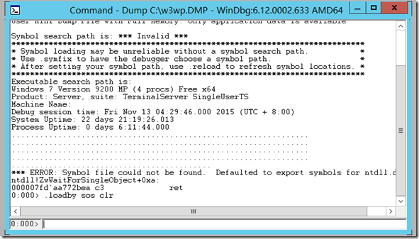
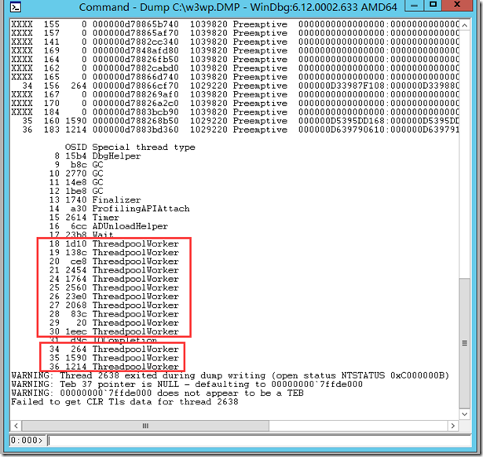
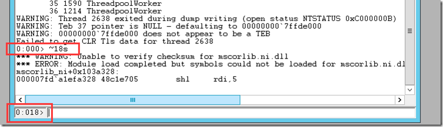
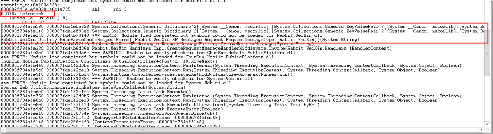

#Windows进程分析
* [抓取Dump](#抓取Dump)
* [使用WinDbg分析](#使用WinDbg分析)
    * [使用WinDbg打开dump文件。](#使用WinDbg打开dump文件。)
    * [加载sos.dll](#加载sos.dll)
    * [查看相关线程信息](#查看相关线程信息)
    * [查看具体线程堆栈](#查看具体线程堆栈)


##抓取Dump
使用任务管理器抓取Dump，如果操作系统较低可以使用“Process Explorer”。



##使用WinDbg分析
###使用WinDbg打开dump文件。
###加载sos.dll
命令：
```
.loadby sos clr
```


###查看相关线程信息
命令：
```
!threads –special
```
special参数会将由CLR创建的特殊线程单独列出便于减少线程的排查工作。




* GC:垃圾回收线程
* Finalizer:对象释放线程，.Net至少有一个，用于专门处理对象释放。
* Timer：计时器线程
* ThreadpoolWorker：工作者线程
* IOCompletion：I/O线程

###查看具体线程堆栈

命令：
```
~{ThreadId}s、!clrstack
~{ThreadId}s：将当前上下文切换到指定的线程内
```


```
!clrstack：得到当前的线程的堆栈信息
```


